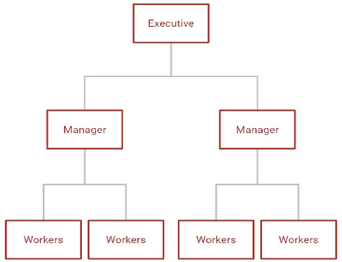

<style type="text/css">
h1{font-size: 24pt}
h2{font-size: 20pt}
h3{font-size: 18pt}
h4,h5,h6{font-size: 16pt}
body{font-size: 16pt}
#doc-metadata {
  margin-bottom: 10px;
  font-size: 0.66em;
}
</style>

```{r setup, include=FALSE}
library(learnr)
library(gradethis)
library(ggcheck)
library(Ryacas)
library(Deriv)
gradethis_setup(exercise.reveal_solution = TRUE)
knitr::opts_chunk$set(echo = FALSE, fig.height = 6, fig.width = 6)
knitr::include_graphics
yac('MaxEvalDepth(100000)')
```

## Firm Decisions

### Three (Related) Decisions:

1.  Cost-Minimizing Combination of Inputs: For a *given* level of (expected) output (firm demand) choose the *combination* of inputs that minimizes the cost of producing that amount to derive the cost function.
2.  Profit-Maximizing Level of Output: Choose the *level* of output that maximizes profits by adjusting quantity (by hiring more/less of the variable input) and/or price of the output.
3.  Long-Run Readjustment: Adjust the level of capital to minimize costs at the given price and quantity in the market. This might happen at the firm level (adjusting firm capacity) or at the industry level (entry/exit of firms).

### Components

1.  Production Technology
2.  Resource Constraints
3.  Input/Output Choices

### Complications

1.  Time Horizon
    a.  Short Run\
    b.  Long Run\
    c.  Sunk versus Fixed Costs\
2.  Market Structure
    a.  Price Taker (Perfect Competition)\
    b.  Price Maker (Pure Monopoly)\
    c.  In-Between (Monopolistic Competition and Oligopoly)\
3.  Transactions Costs
    a.  Negotiation\
    b.  Monitoring\
    c.  Enforcement

## Theory of the Firm

Firms suppress market transactions.

Why do they exist?

### Classical/Neoclassical Approach "Black Box"

Transform inputs into outputs

```{r, fig.height = 1, fig.width = 5}
par(mar = c(1, 1, 1, 1))
plot.new()
plot.window(xlim = c(0,1), ylim = c(0,0.1))
text(0.05, 0.05, "Hire\nInputs")
polygon(x = c(0.4, 0.6, 0.6, 0.4), y = c(0, 0, 0.1, 0.1), col = 'black')
arrows(x0 = 0.1, y0 = 0.05, x1 = 0.4, y1 = 0.05)
text(0.5, 0.05, "???", col = 'white')
arrows(x0 = 0.6, y0 = 0.05, x1 = 0.9, y1 = 0.05)
text(0.95, 0.05, "Sell\nOutputs")
```

<details style="line-height:150%">

<summary>Click here to see the code for the above figure.</summary>

`par(mar = c(1, 1, 1, 1))`<br> `plot.new()`<br> `plot.window(xlim = c(0,1), ylim = c(0,0.1))`<br> `text(0.05, 0.05, "Hire\nInputs")`<br> `polygon(x = c(0.4, 0.6, 0.6, 0.4), y = c(0, 0, 0.1, 0.1), col = 'black')`<br> `arrows(x0 = 0.1, y0 = 0.05, x1 = 0.4, y1 = 0.05)`<br> `text(0.5, 0.05, "???", col = 'white')`<br> `arrows(x0 = 0.6, y0 = 0.05, x1 = 0.9, y1 = 0.05)`<br> `text(0.95, 0.05, "Sell\nOutputs")`<br>

</details>

### Bureaucratic Hierarchy

Manage jointly-owned resources

```{r, fig.align='center', out.width='450px'}

```

### "Nexus of Contracts"

Incentivize productivity and specialization within and between organizations

```{r, fig.align='center', out.width='300px'}

```

## The Production Function

$$y = f(L,K),\text{ where}$$ $$y\text{ is the amount of output the firm produces}$$ $$L\text{ is the amount of labor the firm hires}$$ $$K\text{ is the amount of capital the firm hires}$$ $$f()\text{ describes the technology for transforming inputs (L and K) into output (y)}$$

### Basic Properties

1. Monotonic
2. Transitive
3. Convex?
4. Diminishing Returns

(Similar properties to utility functions; transitivity is trivial in industries where physical output is cardinally measurable.)

### Cobb-Douglas

Since production functions exhibit many of the same properties as utility functions, the Cobb-Douglas function is a common functional form for examples. In the context of production with labor and capital inputs, the Cobb-Douglass (production) function is:

$$ y = AL^{\alpha}K^{(1-\alpha)},\text{ where}$$ Where:

-   $\alpha$ is labor's productivity share.
-   $A$ represents "total factor productivity," or the overall level of technology.

### Other Examples

1.  Constant Elasticity of Substitution $$U(x) = (L^r + K^r)^{\frac{1}{r}},\text{ where}$$

$$s=\frac{1}{1-r} \text{ is the elasticity of substitution.}$$

2.  Polynomial (Short-Run Only?) $$y = aL^3 + bL^2 + cL,\text{ where}$$ $$a<0$$ $$b>0$$ $$c>0$$

### Graphical Representation

Use the `plot_ly()` function to graph the Cobb-Douglas production function for $A = 100$, $0 \le L \le 50$, $0 \le K \le 50$, and $\alpha = 1/3$.

```{r CobbDouglas, exercise=TRUE, exercise.reveal_solution = TRUE}

```

```{r CobbDouglas-solution}
library(plotly)
x = seq(0, 10, 0.1)
y = seq(0, 10, 0.1)
a = 1/3
Q = outer(100*x^(1/3), y^(2/3))
g <- plot_ly(z = ~ U, type = 'surface')  %>%
  layout(scene = list(
    xaxis = list(title = 'Consumption of Good 1'),
    yaxis = list(title = 'Consumption of Good 2'), 
    zaxis = list(title = 'Utility')
  ))
g
```

```{r CobbDouglas-check}
grade_this({if (!inherits(.result, c("plotly"))) {
    fail("Your class of your answer should be a plotly html widget")}
  pass()
})
```

## Production in the Long Run

Decision sequence:\
1. Empirical Market Research: Determine the extent of your market ($\hat{Q}$).\
2. Capital Budgeting: For $\hat{Q}$ and market input prices ($w$ and $r_K$), determine the cost-minimizing combination of inputs ($\hat{L}$ and $\bar{K}$). *This fixes your choice of capital for subsequent short run decisions.*\
3. Adjust *variable* inputs ($L$) to increase or decrease output ($Q$) in the short run in response to temporary fluctuations in demand.\
4. Periodically evaluate the capital budget.

Flexibility of input choices:  \
1. Higher (relative) wages: Use relatively more capital to produce $\hat{Q}$.\
2. Lower (relative) wages: Use relatively more labor to produce $\hat{Q}$.

### Isoquants and their Properties

We can derive three properties for *isoquants* - combinations of inputs that yield equal levels of output - that are similar to the properties of indifference curves.

1.  Isoquants farther from the origin represent *greater output* (monotonicity);\
2.  Isoquants *do not cross* (transitivity);\
3.  Isoquants slope *downward* (monotonicity + diminishing returns);\
4.  Isoquants are *bowed inward* (convexity - a mix of inputs is usually more productive).

Graphically, an isoquant is a horizontal cross-section of the production function at a fixed level of output.

For the Cobb-Douglass example with $\alpha = 1/3$ and $A = 100$, plot the isoquants for $y_1 = 1000$ and $y_2 = 2500$ for $0 \le L \le 50$ and $0 \le K \le 50$.

```{r cdIsoquants, exercise=TRUE, exercise.reveal_solution = TRUE}
```

```{r cdIsoquants-solution}
library(ggplot2)
ggplot() + 
  geom_function(fun = function(x) (1000 / (100*x^(1/3)))^(3/2), color = 'red') + 
  geom_function(fun = function(x) (2500 / (100*x^(1/3)))^(3/2), color = 'purple') + 
  lims(x = c(0,50), y = c(0,50)) + 
  labs(x = "Labor", y = "Capital")
```

```{r cdIsoquants-check}
grade_this({
  if (ith_geom_is(.result, "function", i = 1) & ith_geom_is(.result, "function", i = 2)) {
    pass(random_praise())
  }
  fail(random_encouragement())
})
```

## Marginal Rate of Technical Substitution

### Marginal Product of Labor and Capital

The marginal product of labor is the rate of change in output for a given change in labor hired.

$$MP_L = \frac{df(L,K)}{dL}$$

Graphically, the marginal product is the slope of the production function, holding the level of capital fixed.

The marginal product of capital is the rate of change in output for a given change in capital built or rented.

### Graphical Representation

Graph the marginal product of labor from $0 \le L \le 50$ for levels of capital equal to $10$ and $25$ in a single plot area. 

```{r MPL, exercise = TRUE, exercise.reveal_solution = TRUE}

```

```{r MPL-setup}
library(ggplot2)
```

```{r MPL-solution}
ggplot() + 
  geom_function(fun = function(x) (1/3)*100*10^(2/3)*x^(-2/3), aes(color = "10")) + 
  geom_function(fun = function(x) (1/3)*100*25^(2/3)*x^(-2/3), aes(color = "25")) + 
  lims(x = c(0,50), y = c(0, 100)) + 
  labs(x = "Labor", y = "Marginal Product of Labor", color = "Capital") + 
  scale_colour_manual(values = c("red","purple"))
```

```{r MPL-check}
grade_this({
  if (ith_geom_is(.result, "function", i = 1) & ith_geom_is(.result, "function", i = 2)) {
    pass(random_praise())
  }
  fail(random_encouragement())
})
```

The *marginal rate of technical substitution* between two inputs (e.g. labor and capital, $MRTS_{LK}$) is the ratio of the marginal productivities, $\frac{MP_L}{MP_K}$. The MRTS tells us the firm's ability (through the available production technology) and willingness (to minimize costs) to exchange capital for labor on the margin in such a way that the firm produces the same total amount of output. Hence, the MRTS also represents the slope of the isoquant curve through any given values of $L$ and $K$.

The following code derives the MRTS for our example. 

```{r MRTS, echo = TRUE} 
y <- ysym('100 * L^(1/3) * K^(2/3)') 
MRTS <- (deriv(y, 'L') / deriv(y, 'K')) |>   
  yac_str() |>
  Simplify() |>
  ysym()
```

$$MRTS = `r tex(MRTS)`$$

### General Form

```{r MRTSq, echo = TRUE} 
q <- ysym('A * L^(alpha) * K^(1-alpha)') 
MRTSq <- (deriv(q, 'L') / deriv(q, 'K')) |>   
  yac_str() |>    
  Simplify() |>   
  ysym()
```

$$MRTS = `r tex(MRTSq)`$$

## Returns to Scale

Let's see what happens when we scale up *all* of the inputs in the production function.

Evaluate the Cobb Douglas production function from our example for $(L,K) = {(10,10), (20,20), (30,30)}$. 

```{r RTS, exercise = TRUE, exercise.reveal_solution = TRUE} 
f <- function(L, K) 100*L^(1/3)*K^(2/3)
```

```{r RTS-solution} 
f <- function(L, K) 100*L^(1/3)*K^(2/3)
f(10, 10) 
f(20, 20) 
f(30, 30)
```

```{r RTS-check} 
grade_this({
  if (!inherits(.result, c("numeric"))) {     
    fail("Your class of your answer should be numeric")}   
  if (.result != 3000) {      
    fail("The value of f at L = K = 30 is 3000") }   
  pass() })
```

```{r double, echo=FALSE} 
question("What happens when we double the inputs in the Cobb-Douglas function?",     
         answer("Output more than doubles"),     
         answer("Output doubles", correct = TRUE),     
         answer("Output increases by less than double"),     
         answer("Output decreases"),     
         allow_retry = TRUE   
         )
```

### Constant Returns to Scale

A production technology has *constant returns to scale* whenever scaling up all inputs by the same proportion (e.g. double) increases output by the same proportion (e.g. double).

Examples of constant returns to scale production functions:

1.  Cobb-Douglas $y = AL^{\alpha}K^{1-\alpha}$
2.  Constant Elasticity of Substitution $y = (aL^r + bK^r)^{1/r}$
3.  Linear (Perfect Substitutes) $y = aL + bK$
4.  Perfect Complements (Linear Expansion Path) $y = min\{aL, bK\}$

Isoquants for a constant-returns technology are evenly spaced as the firm chooses to expand production.

Production functions with constant returns to scale correspond to constant long-run average costs.

### Decreasing Returns to Scale (Diseconomies of Scale)

A production technology has *decreasing returns to scale* whenever scaling up all inputs by the same proportion (e.g. double) increases output by less than that proportion (e.g. less than double).

```{r isoquant, echo=FALSE} 
question("What happens to the spacing of the isoquants as output expands by equal amounts for a decreasing-returns production technology?",
         answer("They get closer together."),     
         answer("They remain equally spaced."),     
         answer("They get farther apart.", correct = TRUE),     
         answer("The spacing cannot be determined with the given information."),     
         allow_retry = TRUE   
         )
```

Production functions with *decreasing* returns to scale correspond to *increasing* long-run average costs (diseconomies of scale).

The following code calculates the outputs for doubling and tripling the inputs for a decreasing returns production function.  

```{r DRTS} 
f <- function(L, K) 100*L^(1/3)*K^(1/3)
f(10, 10) 
f(20, 20) 
f(30, 30)
```

### Increasing Returns to Scale

A production technology has *increasing returns to scale* whenever scaling up all inputs by the same proportion (e.g. double) increases output by more than that proportion (e.g. more than double).

Production functions with *increasing* returns to scale correspond to *decreasing* long-run average costs (economies of scale).

The following code calculates the outputs for doubling and tripling the inputs for a increasing returns production function.  

```{r IRTS} 
f <- function(L, K) 100*L^(2/3)*K^(2/3)
f(10, 10) 
f(20, 20) 
f(30, 30)
```

## Short-Run Production Function

In the short run at least one input is fixed (usually capital and/or land). In our two-input production function this makes output a function of only labor.

Graphically, this is like slicing a vertical cross-section of the production function at a specific level of the fixed input (capital).

### Cobb-Douglas Production Function

Plot production as a function of labor for $0 \le L \le 50$ and $K = {10, 25}$.

```{r cdShortRun, exercise=TRUE, exercise.reveal_solution = TRUE}

```

```{r cdShortRun-setup}
library(ggplot2)
```

```{r cdShortRun-solution}
ggplot() + 
  geom_function(fun = function(x) 100*10^(2/3)*x^(1/3), aes(color = "10")) + 
  geom_function(fun = function(x) 100*25^(2/3)*x^(1/3), aes(color = "25")) + 
  lims(x = c(0,50)) + 
  labs(x = "Labor", y = "Output", color = "Capital Input") + 
  scale_colour_manual(values = c("red","purple"))
```

```{r cdShortRun-check}
grade_this({
  if (ith_geom_is(.result, "function", i = 1) & ith_geom_is(.result, "function", i = 2)) {
    pass(random_praise())
  }
  fail(random_encouragement())
})
```

### Polynomial Production Function

Define and graph an expression for the following short-run production function:

$$y = -0.1L^3 + 6L^2 + 2.5L$$

```{r polynomial, exercise = TRUE, exercise.reveal_solution = TRUE}

```

```{r polynomial-setup}
library(ggplot2)
```
 
```{r polynomial-solution}
ggplot() + 
  geom_function(fun = function(x) -0.1*x^3 + 6*x^2 + 2.5*x) + 
  lims(x = c(0,50)) + 
  labs(x = "Labor", y = "Output")
```

```{r polynomial-check}
grade_this({
  if (ith_geom_is(.result, "function", i = 1) & ith_geom_is(.result, "function", i = 2)) {
    pass(random_praise())
  }
  fail(random_encouragement())
})
```

The *marginal product of labor* is the *change* in (i.e. slope, derivative of) the total production function with respect to $L$.

The *average product of labor* is the amount (i.e. level) of output *per-worker*.

```{r MPLvAPL, echo=FALSE}
question("When the marginal product curve reaches its maximum, the average product curve",
    answer("also reaches its maximum"),
    answer("lies above the marginal product curve "),
    answer("continues to rise", correct = TRUE),
    answer("is negative"),
    allow_retry = TRUE
  )
```

## Average Product of Labor

$$AP_L = \frac{f(L,K)}{L}$$

Add `geom_function()` layers to your graph of the marginal product (stored as `g` in the setup) for the average product of labor. Used dashed lines for the average product curves to differentiate them.   

```{r APL, exercise = TRUE, exercise.reveal_solution = TRUE}

```

```{r APL-setup}
library(ggplot2)
g <- ggplot() + 
  geom_function(fun = function(x) (1/3)*100*10^(2/3)*x^(-2/3), aes(color = "10", linetype = "MPL")) + 
  geom_function(fun = function(x) (1/3)*100*25^(2/3)*x^(-2/3), aes(color = "25", linetype = "MPL")) + 
  lims(x = c(0,50), y = c(0, 100)) + 
  labs(x = "Labor", y = "Output", color = "Capital Input") +
  scale_colour_manual(values = c("red","purple")) 
```

```{r APL-solution}
g + 
  geom_function(fun = function(x) 100*10^(2/3)*x^(-2/3), aes(color = "10", linetype = "APL")) + 
  geom_function(fun = function(x) 100*25^(2/3)*x^(-2/3), aes(color = "25", linetype = "APL"))+ 
  labs(x = "Labor", y = "Output", color = "Capital Input", linetype = "Function") +
  scale_linetype_manual(values = c('dashed', 'solid'))
```

```{r APL-check}
grade_this({
  if (ith_geom_is(.result, "function", i = 1) & ith_geom_is(.result, "function", i = 2)) {
    pass(random_praise())
  }
  fail(random_encouragement())
})
```

Sometimes MPL may initially increase before decreasing (e.g. cubic polynomial short run production function). In this case average product will also increase then decrease. Will APL begin decreasing at the same hiring level as MPL? Lower? Higher? 

### Example with Marginal Product Initially Increasing  

```{r APL2}
library(ggplot2)
g <- ggplot() + 
  geom_function(fun = function(x) -0.3*x^2 + 12*x + 2.5, aes(linetype = "MPL")) + 
  lims(x = c(0,50), y = c(0,1250)) + 
  geom_function(fun = function(x) -0.1*x^2 + 6*x + 2.5, aes(linetype = "APL")) + 
  labs(x = "Labor", y = "Output", linetype = "Function") +
  scale_linetype_manual(values = c('dashed', 'solid'))
```

